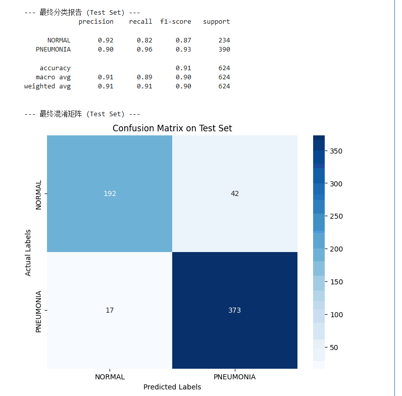

# 基于卷积神经网络(CNN)的肺炎X光图像分类模型
A Convolutional Neural Network (CNN) based Classification Model for Pneumonia X-ray Images

## 项目概述

本项目旨在应用深度学习中的**卷积神经网络 (CNN)** 和**迁移学习 (Transfer Learning)** 技术，解决一个具体的医疗影像二分类问题：从胸部X光片中自动识别肺炎病例。

项目基于公开的“胸部X光（肺炎）”数据集，通过在预训练的 `MobileNetV2` 模型上进行微调，并实施了一系列针对性的优化策略（如处理类别不平衡、数据增强、两阶段训练等），最终构建的分类模型在独立的测试集上达到了高精度和高召回率。

## 数据集

-   **数据集来源**: [Chest X-ray Images (Pneumonia) on Kaggle](https://www.kaggle.com/paultimothymooney/chest-xray-pneumonia)
-   **数据结构**: 为保证评估的可靠性，本项目放弃了数据集中规模过小的 `val` 文件夹，而是从包含5216张图片的 `train` 文件夹中，以80/20的比例分割出新的训练集和验证集。
-   **数据特点**: 这是一个二分类问题（正常 vs. 肺炎），但存在类别不平衡现象，肺炎样本（3875张）远多于正常样本（1341张）。

## 技术实现与工作流程

1.  **数据管道构建**: 使用 PyTorch 的 `ImageFolder` 和 `DataLoader` 构建高效的数据加载管道。对训练集施以 `torchvision.transforms` 中定义的随机裁切、旋转、翻转等数据增强操作，以提升模型泛化能力。所有图像均根据 ImageNet 的均值和标准差进行归一化。

2.  **模型架构**:
    -   **骨干网络 (Backbone)**: 使用 `torchvision.models` 加载在 ImageNet 上预训练的 `MobileNetV2` 作为特征提取的骨干网络。
    -   **迁移学习**: 替换 `MobileNetV2` 原始的1000类输出的全连接层，为一个新的、适用于本项目二分类任务的自定义分类头。其结构为：`GlobalAveragePooling` -> `Dropout(0.5)` -> `Linear(1)`。最终输出一个单独的 logit。

3.  **类别不平衡处理**:
    -   在损失函数 `torch.nn.BCEWithLogitsLoss` 中，通过精确计算训练集中 `(正常样本数 / 肺炎样本数)` 的比值，来设置 `pos_weight` 参数。该策略在计算损失时，显著增加了对少数类（正常样本）分类错误的惩罚权重，从而有效纠正了模型的学习偏见。

4.  **两阶段训练策略**:
    -   **第一阶段（特征提取）**: 冻结骨干网络 `MobileNetV2` 的所有参数 (`param.requires_grad = False`)，仅训练新添加的分类头。此阶段旨在让分类头快速学习如何利用预训练模型提取的现有特征来进行判断，并使模型达到一个稳定的性能基准。
    -   **第二阶段（微调）**: 解冻所有网络层 (`param.requires_grad = True`)，并使用一个极低的学习率（`1e-5`）对整个网络进行端到端微调 (end-to-end fine-tuning)。此阶段旨在让预训练的特征提取器本身也能够稍微调整，以更好地适应X光片的独特纹理和分布。

5.  **训练过程优化**:
    -   在训练循环中，通过比较每一轮的验证准确率，手动实现了 `ModelCheckpoint` 的逻辑，仅保存在验证集上表现最佳的模型权重。
    -   使用 `torch.optim.lr_scheduler.ReduceLROnPlateau` 监测验证损失（`val_loss`），当其连续多个轮次不再下降时，自动降低学习率，以实现更精细的收敛。

## 最终结果

经过上述流程，最终保存在验证集上性能最佳的模型，在独立的测试集上取得了：

-   **测试集准确率: 90.87%**

从分类报告和混淆矩阵中可以看出，模型在**肺炎**类别上实现了高达**96%的召回率**，这意味着模型识别真实病人的能力强，漏诊率低。在医疗辅助诊断场景中非常有价值。
